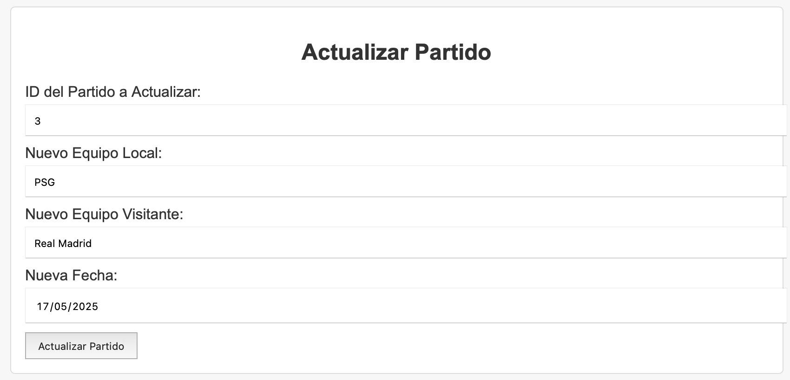
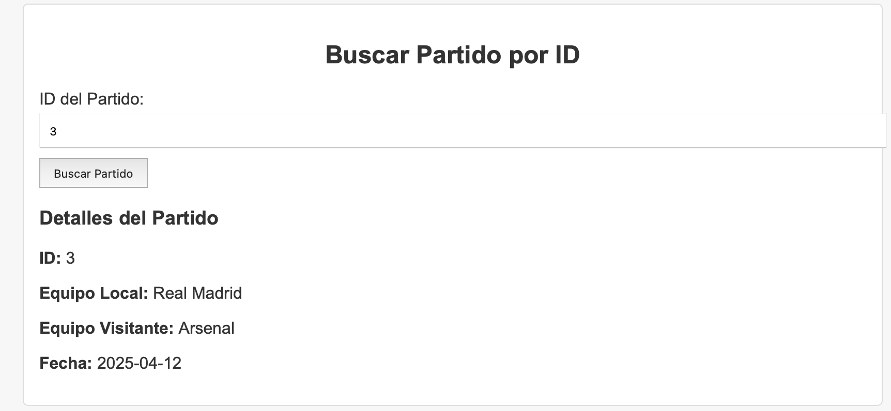
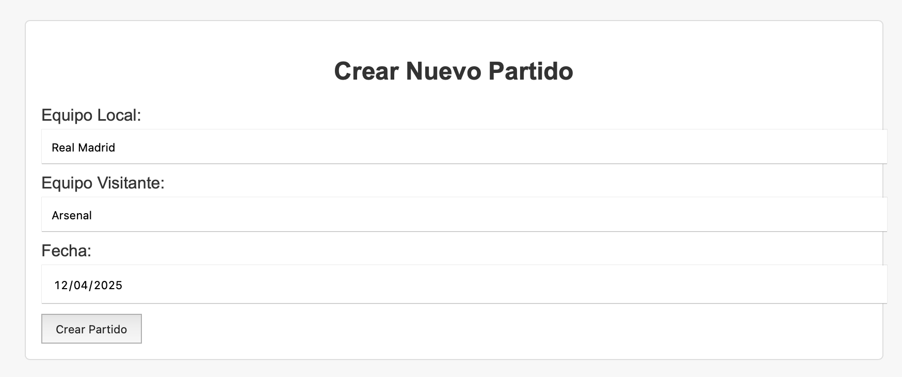
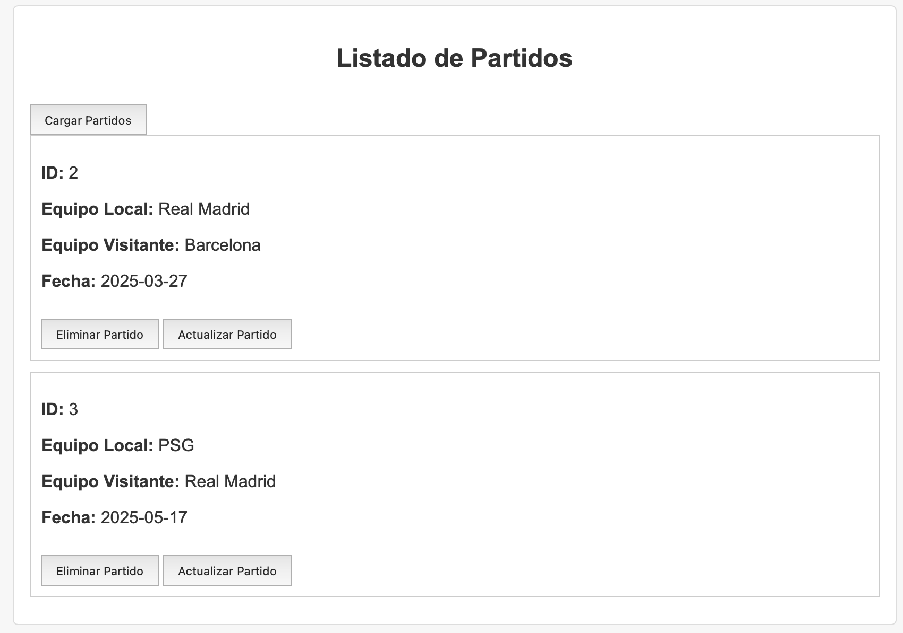

# La Liga Tracker - Backend

Este proyecto es el backend para la aplicación web **La Liga Tracker**, desarrollada como parte del laboratorio de desarrollo backend. Permite gestionar partidos de La Liga y se conecta con un frontend ya existente.

---

## 🚀 Tecnologías usadas

- **Go (Golang)** – Backend REST API
- **Gin** – Framework web para Go
- **GORM** – ORM para manejar base de datos
- **SQLite** – Base de datos ligera
- **Docker** – Para ejecución del backend en un contenedor

## Vistas de frontend
Frontend funcionando:

## Ejecutar con Docker

- Contruir la imagen con Docker:
- docker build -t laliga-backend
- Correr el contenedor en el puerto 8080:
- docker run -p 8080:8080 laliga-backend
